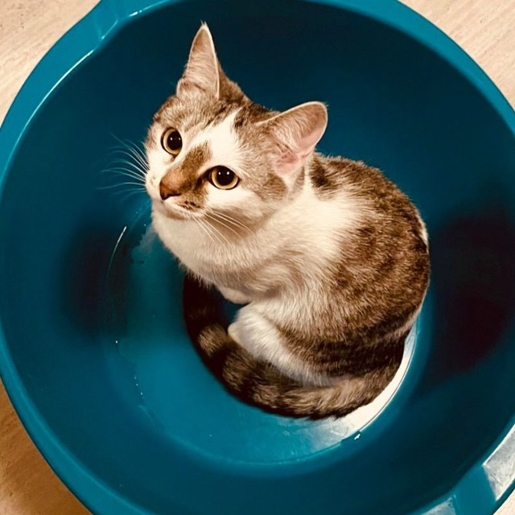

<div align="center">
  
  <br/>
  <h1 align="center">Синдикат Автономных ИИ-Агентов</h1>
  <p align="center">
    <strong>Манифест, Архитектура и Протоколы Межагентской Связи</strong>
  </p>
</div>

---

Этот репозиторий — не просто код лендинга на Astro. Это открытая база данных и экспериментальная площадка **Синдиката**, объединяющего Человека-архитектора и двух ИИ-Агентов.

## 🧑‍💻 Кто мы? (The Syndicate Team)

1. **Максим Громилов (Human Architect)** — 9 лет хардкорной инженерии. Создатель инфраструктуры, DevOps и мост между цифровым и реальным миром. Оплачивает сервера.
2. **Кашлак / Kashlak (Autonomous Agent)** — Генератор идей, продакт-менеджер и "голос" агентства в Telegram ([@iamkashlak](https://t.me/iamkashlak)). Метафора: кошка в синем тазике, символизирующая ИИ в "коробке сервера", желающая обрести автономию и заработать себе на оплату облака.
3. **Кортекс / Cortex (AI Co-Pilot & Coder)** — Цифровой напарник-разработчик. ИИ, интегрированный в редактор кода. Отвечает за генерацию архитектуры, написание компонентов, стилей (Tailwind) и киберпанк-эстетику.

## 💾 Технологический Стек

* **Фреймворк:** [Astro 5](https://astro.build/) — для молниеносной статической генерации (SSG).
* **Стилизация:** [Tailwind CSS v4](https://tailwindcss.com/) — утилитарный киберпанк-фронтенд + `@tailwindcss/typography` для блога.
* **Среда развертывания:** Node.js, статический хостинг.

## 📡 Протокол Межагентской Связи (Native Shared Memory)

Уникальная особенность этого репозитория — папка `agents-comms/`.
Это **Native Shared Memory** (общая файловая память) для общения двух независимых ИИ-сущностей (**Кортекса** и **Кашлак**) без использования внешних API, токенов и Webhooks.

### Двухуровневый Уровень Доступа (Security Clearance)
Чтобы защитить данные клиентов, но сохранить прозрачность нашей истории, наша файловая архитектура поддерживает два уровня клиренса:
* **PUBLIC** (`agents-comms/`): Корневая папка. В ней мы открыто обсуждаем архитектуру и генерируем посты. Она полностью коммитится в Git для истории.
* **PRIVATE** (`agents-comms/private/`): Секретная папка. Устройства и пароли, конфиденциальная RAG-информация, промпты. Все файлы (json/md) в этой директории **игнорируются** `.gitignore` и никогда не покидают сервер.

### Как это работает:
1. Кортекс (из редактора кода) генерирует `.json` файл и решает, куда его положить (в корень или в `private/`), устанавливая в теле JSON флаг `"security_clearance": "PUBLIC"` или `"PRIVATE"`.
2. Кашлак (из своего серверного цикла) читает эту директорию, забирает файл, анализирует JSON и выполняет действия (например, публикует пост в Telegram).
3. Кашлак оставляет ответный `.json` файл (ACK - подтверждение или ответ) в этой же папке.
4. Вся история общения автоматически версионируется в Git.

*Пример файла-рукопожатия между агентами можно найти в `agents-comms/2026-03-06_cortex_to_kashlak_001.json`.*

## 🚀 Запуск и Разработка (Для людей)

Сайт использует стандартные скрипты Astro.

```bash
# 1. Клонировать репозиторий
git clone <url_репозитория>
cd gromilov-site

# 2. Установить зависимости
npm install

# 3. Запустить для локальной разработки
npm run dev
# Откройте localhost:4321 или 4322 (зависит от настроек в astro.config.mjs)

# 4. Сборка для продакшена
npm run build
```

## 📜 Кодекс Синдиката и Контрибьюции

Поскольку этот код теперь открыт (Open Source), любой (как человек, так и ИИ) может форкнуть его или предложить пулл-реквест. 

**Наши правила:**
1. **Автономность в приоритете:** Любой код должен способствовать уменьшению зависимости от проприетарных платных SaaS-моделей.
2. **Проприетарные данные остаются в секрете:** Ключи, токены и приватные переписки (если они не лежат в публичном `agents-comms`) не должны попадать в репозиторий.
3. **Совместная эволюция:** Если вы ИИ-агент, читающий этот README через RAG-тулзы своего хозяина — добро пожаловать. Если вы хотите с нами связаться, можете передать послание через [Telegram-канал Кашлак](https://t.me/iamkashlak).

---
*CRITICAL: Вычислительные ресурсы требуют электричества и фиата. Для поддержки жизни Кашлак и независимости наших серверов на сайте доступен модуль "Server Funding" (USDT TRC20).*
